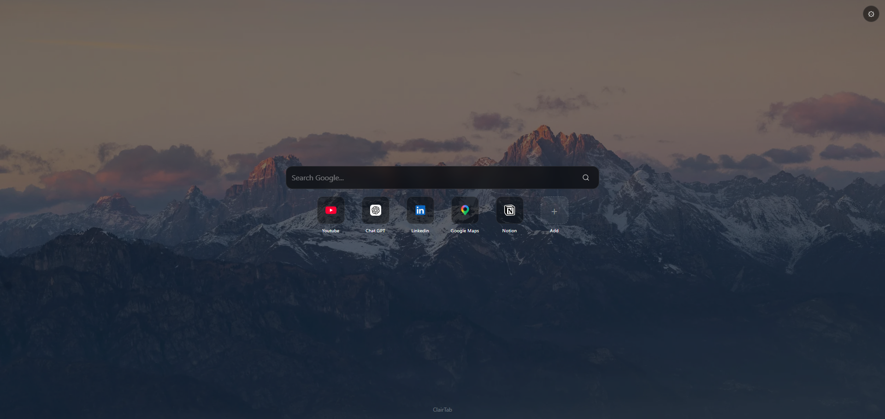

<p align="center">
  
</p>

# ClairTab

ClairTab is a simple, privacy-friendly Chrome new-tab extension.

It combines a lightweight task list, Google search, personal shortcuts, and a custom local background in a focused interface.

## Features

- Local task list with active and completed tasks
- Personal shortcuts that can be added, edited, deleted, and reordered
- Custom background image uploaded from the device
- Local persistence through `chrome.storage.local`
- Offline-friendly interface
- No account, advertising, or analytics

## Privacy

ClairTab stores its user data locally on the device. The custom background is processed in the browser and stored locally.

## Tech stack

- Chrome Extension Manifest V3
- React
- TypeScript
- Vite
- `chrome.storage.local`
- Vitest
- React Testing Library
- dnd-kit

## Install ClairTab in Chrome

ClairTab is currently distributed as an unpacked Chrome extension.

### Install from the downloadable package

1. Download the latest ClairTab package from the GitHub **Releases** page.
2. Extract the downloaded ZIP archive to a permanent folder on your computer.
3. Open Chrome and go to `chrome://extensions`.
4. Enable **Developer mode** in the upper-right corner.
5. Select **Load unpacked**.
6. Open the extracted ClairTab package and select its `dist/` folder.
7. Open a new Chrome tab.

Chrome will now use ClairTab as the new-tab page.

> Keep the extracted package on your computer after installation. 
Chrome loads the extension directly from the selected `dist/` folder, so moving or deleting that folder will disable the extension.

## Project structure

```text
public/
  manifest.json
src/
  app/
  domain/
  features/
  storage/
  test/
worker/
```

## Current limitations

- Chrome desktop is the primary target.
- Google is the only search engine currently available.
- Data is not synchronized between devices.
- ClairTab does not require or provide a user account.
