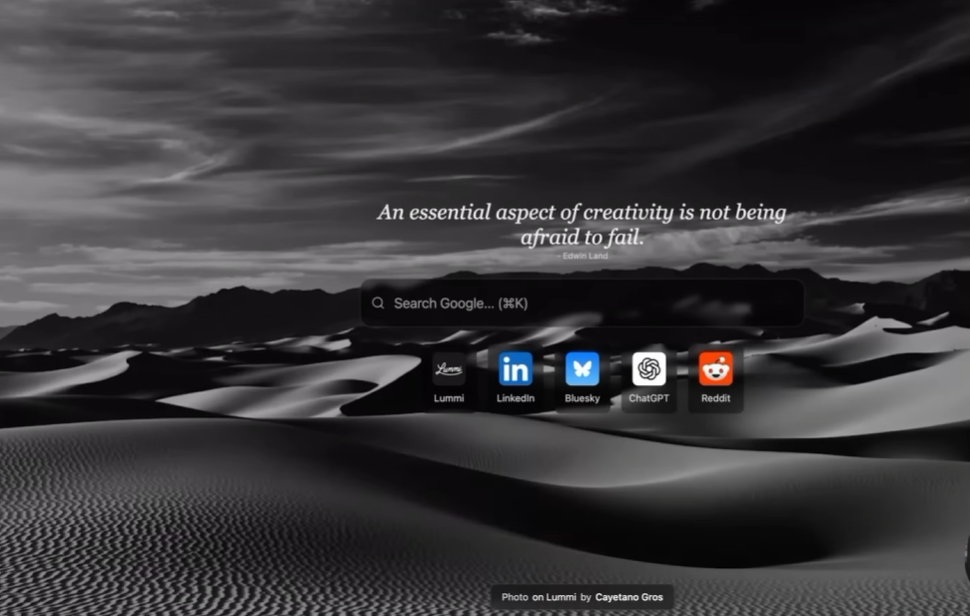

# Direction UI — ClairTab

## Référence visuelle



Cette image est une **référence d'intention**, pas un écran à reproduire pixel par pixel. Elle définit le niveau d'immersion, la hiérarchie et la sobriété recherchés.

## Intention visuelle

L'expérience doit être :

- immersive ;
- cinématographique ;
- calme ;
- très peu chargée ;
- centrée sur une seule action ;
- lisible sur une photo expressive ;
- plus proche d'un écran d'accueil éditorial que d'un dashboard de productivité.

La photo occupe tout le viewport. L'interface semble posée par-dessus, sans créer une grande carte centrale opaque.

## Composition de référence

```text
┌──────────────────────────────────────────────────────────────┐
│                                                Réglages      │
│                                                              │
│                     Citation / intention                      │
│                                                              │
│               ┌──────────────────────────┐                   │
│               │ Recherche ou ajout tâche │                   │
│               └──────────────────────────┘                   │
│                                                              │
│                 Raccourcis personnels                        │
│                                                              │
│                                                              │
│                    Crédit de la photo                         │
└──────────────────────────────────────────────────────────────┘
```

### Positionnement desktop

- Le groupe principal est centré horizontalement.
- Son centre visuel se situe autour de 43 à 48 % de la hauteur du viewport.
- Largeur cible : `min(680px, calc(100vw - 40px))`.
- L'ensemble citation + module principal + raccourcis forme une colonne compacte.
- Les réglages restent discrets dans l'angle supérieur droit.
- L'attribution reste en bas, centrée ou alignée à droite selon la lisibilité.

### Positionnement mobile ou fenêtre étroite

- Marges latérales de 16 px.
- Citation raccourcie ou masquée si elle gêne l'action.
- Module principal en pleine largeur disponible.
- Raccourcis en grille de 4 colonnes ou en défilement horizontal.
- Crédit photo sur deux lignes si nécessaire.
- Aucun élément ne doit être coupé à 320 CSS px.

## Fond photographique

### Traitement

- Image `cover`, centrée, sans distorsion.
- Couleur de secours affichée immédiatement.
- Voile sombre global ou gradient local derrière le contenu.
- La référence noir et blanc peut devenir un thème visuel, mais le produit doit aussi supporter des photographies en couleur.
- Un léger assombrissement et une réduction de saturation sont acceptables pour protéger la lisibilité.
- Aucun flou appliqué à toute l'image ; le flou est réservé aux surfaces d'interface.

### Chargement

1. afficher la couleur ou le dernier fond local ;
2. rendre l'interface ;
3. charger la photo distante ;
4. précharger avant transition ;
5. effectuer un fondu court ;
6. conserver l'ancien fond si la nouvelle image échoue.

## Citation ou phrase d'intention

La référence utilise une citation éditoriale au-dessus de la recherche.

### Recommandation MVP

Conserver cet emplacement comme **élément d'ambiance optionnel**, alimenté localement. Il ne doit pas dépendre d'un service distant.

Deux options compatibles :

1. une courte phrase originale fournie par le produit ;
2. une phrase personnelle configurée localement par l'utilisateur dans une évolution ultérieure.

Éviter une base de citations non vérifiée ou des contenus soumis à des droits.

### Style

- Serif ou serif éditoriale locale.
- Italique.
- 24 à 32 px sur desktop.
- 18 à 22 px sur petite largeur.
- Maximum deux lignes.
- Auteur ou source en 11 à 13 px.
- Largeur maximale de 560 px.
- Ombre ou contraste léger, sans contour excessif.

L'absence de citation ne doit pas laisser un vide gênant : le groupe principal remonte légèrement.

## Module principal commun

Le mode Recherche et le mode Focus utilisent **la même empreinte visuelle** afin que la bascule ne déstructure pas l'écran.

### Surface

- Fond noir ou très sombre à 58-72 % d'opacité.
- `backdrop-filter: blur(14px)` lorsque supporté.
- Fallback opaque si le blur n'est pas disponible.
- Bordure blanche très légère : 6-10 % d'opacité.
- Rayon de 14 à 18 px.
- Ombre diffuse, sans effet néon.
- Hauteur de base : 56 à 60 px.

### Mode Recherche

- Icône loupe à gauche.
- Placeholder : `Rechercher sur Google...`.
- Indication de raccourci à droite : `⌘ K` ou `Ctrl K`.
- Soumission avec Entrée.
- Aucun bouton primaire visible si Entrée suffit.
- Une requête vide reste sur place avec une erreur discrète.

### Mode Focus

La même surface devient un champ d'ajout de tâche :

- icône cercle ou coche à gauche ;
- placeholder : `Que veux-tu accomplir ?` ;
- Entrée ajoute la tâche ;
- sous le champ, afficher au maximum trois tâches actives dans une surface légère ;
- lien discret `Voir toutes les tâches` si nécessaire ;
- les tâches terminées restent repliées par défaut.

La liste ne doit pas transformer l'écran en gestionnaire de projet. Le nouvel onglet doit conserver sa respiration.

## Bascule Focus / Recherche

La bascule doit être présente mais secondaire.

Options recommandées :

- mini segmented control au-dessus du module ;
- deux icônes avec labels accessibles ;
- raccourcis clavier documentés.

Éviter de mettre un gros onglet ou une navigation globale qui attirerait plus l'attention que l'action principale.

## Raccourcis

### Présentation

- Une seule rangée sur desktop lorsque 5 à 8 raccourcis sont visibles.
- Tuiles compactes de 56 à 68 px.
- Icône ou monogramme dans un carré arrondi.
- Libellé sous l'icône, une ligne, ellipsis.
- Fond de tuile sombre translucide ou uniquement au survol selon le contraste.
- Le bouton d'ajout utilise le même gabarit, avec un `+`.

### Interaction

- Survol : légère élévation ou éclaircissement.
- Focus clavier : contour visible.
- Activation : navigation immédiate.
- Édition accessible par menu contextuel explicite ou action secondaire.
- Aucun favicon chargé depuis un tiers dans le MVP.

## Réglages

- Icône discrète dans l'angle supérieur droit.
- Surface ouverte en panneau latéral ou popover.
- Le panneau peut être plus opaque que le centre.
- Réglages MVP :
  - mode par défaut ;
  - thème ;
  - phrase d'ambiance activée ou non ;
  - réduction de mouvement ;
  - réinitialisation.

Les réglages ne sont pas affichés en permanence.

## Attribution photo

- Toujours présente pour une photo distante.
- Petite pastille sombre translucide.
- 11 à 12 px.
- Exemple : `Photo par Nom sur Unsplash`.
- Liens accessibles et focus visible.
- Ne pas masquer l'attribution derrière une interaction de survol seulement.

## Typographie

### Interface

- Police système ou sans serif locale : Inter, Geist, system-ui.
- Poids 400 à 600.
- Tailles compactes.
- Pas de capitales longues.

### Citation

- Serif distincte : Georgia, Charter ou une fonte locale équivalente.
- Ne pas charger de fonte distante.

## Palette fonctionnelle

Il ne s'agit pas d'un design system complet, mais de garde-fous :

```text
Texte principal : blanc 92-100 %
Texte secondaire : blanc 60-74 %
Surface principale : noir 58-72 %
Surface secondaire : noir 38-58 %
Bordure : blanc 6-12 %
Erreur : teinte lisible sur surface sombre, accompagnée d'un texte
Focus : contour clair d'au moins 2 px
```

La photo fournit la couleur dominante. L'interface doit rester neutre.

## Mouvement

- Fondu du fond : 250 à 450 ms.
- Apparition du module : 120 à 180 ms maximum.
- Hover des raccourcis : 120 à 160 ms.
- Aucun parallaxe.
- Aucun zoom continu de l'image.
- Toutes les animations non essentielles sont supprimées avec `prefers-reduced-motion`.

## États à dessiner ou tester

- première ouverture ;
- fond local ;
- fond distant chargé ;
- fond distant en erreur ;
- recherche vide ;
- mode Focus vide ;
- trois tâches actives ;
- tâches terminées ;
- zéro raccourci ;
- huit raccourcis ;
- douze raccourcis ;
- panneau de réglages ;
- dialogue de raccourci ;
- largeur 320 px ;
- zoom 200 % ;
- navigation clavier ;
- contraste difficile sur photo claire.

## Critères visuels d'acceptation

- L'action principale est identifiable avant les raccourcis et réglages.
- Le fond reste le premier élément visuel sans réduire la lisibilité.
- Aucun grand panneau opaque ne couvre inutilement la photo.
- La composition reste centrée et équilibrée.
- Les raccourcis forment une ligne ou une grille stable.
- Le crédit photo est visible mais secondaire.
- Le mode Focus conserve la même silhouette que le mode Recherche.
- Le contenu critique reste utilisable sans blur CSS.
- Le rendu fonctionne avec photo claire, sombre, colorée et monochrome.
- L'interface reste exploitable à 320 px et au zoom 200 %.

## Ce qu'il faut éviter

- Dashboard avec multiples widgets.
- Cartes blanches ou panneaux volumineux.
- Barre latérale persistante.
- Grand titre marketing.
- Plusieurs actions primaires.
- Citation longue.
- Effets glassmorphism sans contraste.
- Icônes incohérentes.
- Animation décorative continue.
- Récupération de favicon ou de citation depuis un service tiers.
- Reproduction littérale des marques et icônes visibles dans la référence.

## Portée

Cette direction visuelle guide le MVP. Elle ne demande pas la création d'un design system complet. Toute divergence importante doit être documentée dans un work record ou une décision.
